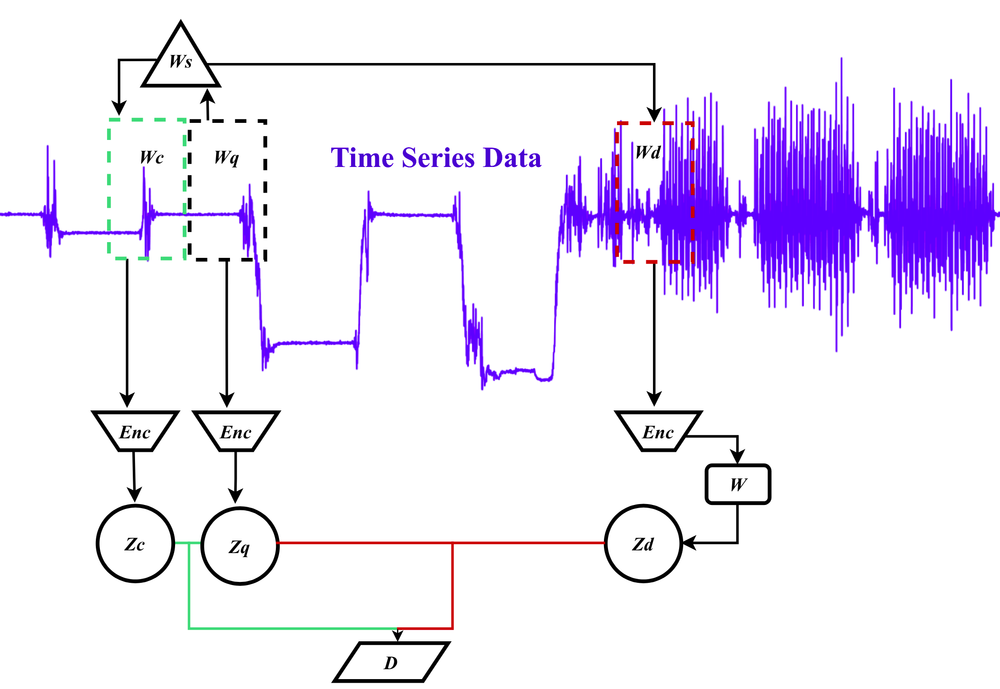

# An Evaluation of Temporal Neighborhood Coding Variants in Smartphone-Based Human Activity Recognition
 Please note that this code is heavily inspired by Maxwell A Xu of REBAR, that can be found at https://github.com/maxxu05/rebar. The code was changed in order to be focused only in HAR data and comparing TNC with two different encoders with configurations of the window selector method and w parameter. The original code is also referenced at the paper 

Code for An Evaluation of Temporal Neighborhood Coding Variants in Smartphone-Based Human Activity Recognition published at the 34th Brazilian Conference on Intelligent Systems (BRACIS). 

 

Technique of TNC.  The window selector W_s selects the neighbor W_c and non-neighbor window W_d for each query window W_q. The encoder Enc learns the data representation and feed the samples Z_c and Z_d into a discriminator D that predicts the probability of the windows being neighbors to W_q.

This repository includes code to reproduce the experimental results. This includes code for running both of our downstream evaluations, Linear Probe Classification and TSNE, and code to download and preprocess each of UCI-raw dataset, directly from their original online repositories. 

 

## Setup 

To run this project, first install the requirements:

    pip install -r requirements.txt

We can then download and preprocess the HAR dataset by running this command:

    python data/process/har_processdata.py

-----

## Running all the experiments

To run all the TNC variants for har:

    python run_all_experiments.py

This code is going to run by default 8 executions of each variant and save the results to experiment_results.csv

## Custom Training and Evaluating

You can also try minor experiments by simply running `run_exp.py` with the `-c` argument, as shown below.

    python run_exp.py -c tnc_har_TS2Vec_sim_0.2

The `-c` refers to the specific dictionary str key associated with a given config that includes all experimental parameters, such as epochs to train or learning rate. The exact TNC experiment configs associated with `tnc_har`  can be found in `experiments/configs/tnc_expconfigs.py`. 

To change the parameters, just access the `experiments/configs/tnc_expconfigs.py` and change what you want, as shown below:

    alltnc_expconfigs["tnc_har_TS2Vec_sim_0.2"] = TNC_ExpConfig(
    w=0.2, mc_sample_size=5, subseq_size=128, data_name="har", 
    epochs=epochs, lr=0.00001, batch_size=batch_size, save_epochfreq=10, 
    encoder_dims=320, encoder_type="TS2Vec", adf=False
)

After running, results will be saved to experiments/out/har

Note: the model outputs with logs of metrics will be saved in the folder `experiments/out/tnc_har`. If you run the experiment again it will use the best model trained and output just the metrics and plot of linear readout. 

## Statistical tests

After running experiments with run_all_experiments.py you can use the following script to see boxplots, evaluate normality and perform wilcoxon signed rank test:

    python experiments/statistical_tests.py
